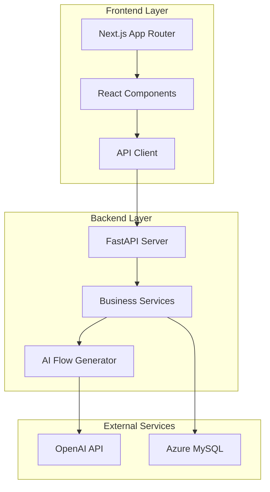

# Design Document

## Overview

The AI Business Flow application is a web-based tool that helps business DX/improvement personnel transform interview content into structured business process diagrams. The system follows a three-screen workflow: project management, hearing input, and flow editing. The AI acts as an organizer rather than an advisor, generating editable 60-point flow diagrams that users can refine.

The architecture emphasizes simplicity, automatic saving, and a clean user experience that encourages progress over perfection. The system is designed as an MVP with clear scope limitations to maintain focus on core value delivery.

## Architecture

### System Architecture

The application follows a modern full-stack architecture with clear separation between frontend, backend, and data layers:



### Technology Stack

**Frontend:**
- Next.js 14+ with App Router for modern React development
- TypeScript for type safety and better developer experience
- Tailwind CSS for utility-first styling and consistent design
- Centralized API communication through `lib/api.ts`

**Backend:**
- FastAPI with Python 3.11+ for high-performance async API development
- SQLAlchemy ORM for database operations and model management
- Uvicorn ASGI server for production deployment
- Pydantic for request/response validation and serialization

**Database:**
- Azure Database for MySQL for reliable cloud-hosted data persistence
- Connection pooling and session management through SQLAlchemy

**AI Integration:**
- OpenAI API for natural language processing and flow generation
- Async client initialization using FastAPI lifespan events
- Structured prompting for consistent JSON output format

## Components and Interfaces

### Frontend Components

**Project Management (`components/project/`)**
- `ProjectList.tsx`: Displays grid of existing projects with status and timestamps
- `ProjectCard.tsx`: Individual project card with hover states and navigation
- `CreateProject.tsx`: Modal or inline form for new project creation

**Hearing Input (`components/hearing/`)**
- `HearingInput.tsx`: Main text input interface with auto-save functionality
- `HearingHistory.tsx`: Chronological display of previous hearing log entries
- `HearingPrompts.tsx`: Encouraging text and guidance for users

**Flow Editing (`components/flow/`)**
- `FlowDiagram.tsx`: Main flow visualization with drag-and-drop support
- `FlowNode.tsx`: Individual flow step with inline editing capabilities
- `FlowControls.tsx`: Add node, undo, and other flow manipulation controls

**Common Components (`components/common/`)**
- `Layout.tsx`: Consistent page layout with navigation
- `LoadingSpinner.tsx`: Loading states for async operations
- `ErrorBoundary.tsx`: Error handling and user feedback

### Backend Services

**Project Service (`services/project.py`)**
```python
class ProjectService:
    async def create_project(self, name: str) -> Project
    async def get_projects(self) -> List[Project]
    async def update_project(self, project_id: int, updates: dict) -> Project
    async def delete_project(self, project_id: int) -> bool
```

**Hearing Service (`services/hearing.py`)**
```python
class HearingService:
    async def add_hearing_log(self, project_id: int, content: str) -> HearingLog
    async def get_hearing_logs(self, project_id: int) -> List[HearingLog]
    async def update_hearing_log(self, log_id: int, content: str) -> HearingLog
```

**Flow Service (`services/flow.py`)**
```python
class FlowService:
    async def generate_flow(self, project_id: int) -> List[FlowNode]
    async def update_flow_node(self, node_id: int, text: str) -> FlowNode
    async def reorder_flow_nodes(self, project_id: int, node_orders: List[dict]) -> List[FlowNode]
    async def delete_flow_node(self, node_id: int) -> bool
    async def add_flow_node(self, project_id: int, text: str, order: int) -> FlowNode
```

**AI Service (`services/ai.py`)**
```python
class AIService:
    async def generate_business_flow(self, hearing_logs: List[str]) -> List[dict]
    def _format_prompt(self, hearing_content: str) -> str
    def _parse_ai_response(self, response: str) -> List[dict]
```

### API Endpoints

**Project Endpoints**
- `GET /api/projects` - List all projects
- `POST /api/projects` - Create new project
- `PUT /api/projects/{id}` - Update project details
- `DELETE /api/projects/{id}` - Delete project

**Hearing Endpoints**
- `GET /api/projects/{id}/hearing` - Get hearing logs for project
- `POST /api/projects/{id}/hearing` - Add new hearing log
- `PUT /api/hearing/{id}` - Update hearing log content

**Flow Endpoints**
- `GET /api/projects/{id}/flow` - Get flow nodes for project
- `POST /api/projects/{id}/flow/generate` - Generate flow from hearing logs
- `PUT /api/flow/nodes/{id}` - Update flow node content
- `POST /api/flow/nodes` - Add new flow node
- `DELETE /api/flow/nodes/{id}` - Delete flow node
- `PUT /api/projects/{id}/flow/reorder` - Reorder flow nodes

## Data Models

### Database Schema

**Project Model**
```python
class Project(Base):
    __tablename__ = "projects"
    
    id: int = Column(Integer, primary_key=True, index=True)
    name: str = Column(String(255), nullable=False)
    department: Optional[str] = Column(String(100), nullable=True)
    status: str = Column(String(50), default="draft")
    created_at: datetime = Column(DateTime, default=func.now())
    updated_at: datetime = Column(DateTime, default=func.now(), onupdate=func.now())
    
    hearing_logs = relationship("HearingLog", back_populates="project")
    flow_nodes = relationship("FlowNode", back_populates="project")
```

**HearingLog Model**
```python
class HearingLog(Base):
    __tablename__ = "hearing_logs"
    
    id: int = Column(Integer, primary_key=True, index=True)
    project_id: int = Column(Integer, ForeignKey("projects.id"))
    content: str = Column(Text, nullable=False)
    created_at: datetime = Column(DateTime, default=func.now())
    
    project = relationship("Project", back_populates="hearing_logs")
```

**FlowNode Model**
```python
class FlowNode(Base):
    __tablename__ = "flow_nodes"
    
    id: int = Column(Integer, primary_key=True, index=True)
    project_id: int = Column(Integer, ForeignKey("projects.id"))
    text: str = Column(String(500), nullable=False)
    order: int = Column(Integer, nullable=False)
    created_at: datetime = Column(DateTime, default=func.now())
    updated_at: datetime = Column(DateTime, default=func.now(), onupdate=func.now())
    
    project = relationship("Project", back_populates="flow_nodes")
```

### Pydantic Schemas

**Request/Response Models**
```python
class ProjectCreate(BaseModel):
    name: str
    department: Optional[str] = None

class ProjectResponse(BaseModel):
    id: int
    name: str
    department: Optional[str]
    status: str
    created_at: datetime
    updated_at: datetime

class HearingLogCreate(BaseModel):
    content: str

class HearingLogResponse(BaseModel):
    id: int
    project_id: int
    content: str
    created_at: datetime

class FlowNodeResponse(BaseModel):
    id: int
    project_id: int
    text: str
    order: int
    created_at: datetime
    updated_at: datetime

class FlowNodeUpdate(BaseModel):
    text: str

class FlowReorderRequest(BaseModel):
    node_orders: List[dict]  # [{"id": 1, "order": 0}, {"id": 2, "order": 1}]
```

## Correctness Properties

*A property is a characteristic or behavior that should hold true across all valid executions of a system-essentially, a formal statement about what the system should do. Properties serve as the bridge between human-readable specifications and machine-verifiable correctness guarantees.*

Based on the prework analysis of acceptance criteria, the following properties ensure system correctness:

### Property 1: Project Creation Consistency
*For any* project creation request, the system should create a project with draft status and allow immediate name editing.
**Validates: Requirements 1.2, 1.3**

### Property 2: Automatic Data Persistence
*For any* user input or modification (project changes, hearing content, flow edits), the system should automatically persist the data to the database without requiring explicit save actions.
**Validates: Requirements 1.4, 2.3, 4.8, 6.1, 6.2**

### Property 3: Hearing Log Storage and Ordering
*For any* hearing content input, the system should store it as a timestamped entry and display all logs in chronological order.
**Validates: Requirements 2.2, 2.4**

### Property 4: AI Flow Generation Constraints
*For any* project with hearing logs, the AI generator should produce a JSON response containing 5-8 linear flow nodes without branching, improvement suggestions, evaluations, or scoring.
**Validates: Requirements 3.1, 3.2, 3.3, 3.4, 3.5, 8.2, 8.3**

### Property 5: Flow Node Manipulation
*For any* flow node, users should be able to edit content inline, delete the node, or reorder it through drag operations, with each action automatically persisted.
**Validates: Requirements 4.3, 4.4, 4.5**

### Property 6: Flow Display and Interaction
*For any* flow diagram, the system should display nodes in vertical sequence with connecting lines, show edit/delete options on hover, and allow adding new nodes.
**Validates: Requirements 4.1, 4.2, 4.6**

### Property 7: Undo Functionality
*For any* user operation, the system should provide undo capability for the most recent action only.
**Validates: Requirements 4.7**

### Property 8: Data Integrity and Timestamps
*For any* project or hearing log, the system should maintain creation and update timestamps, and preserve all data across user sessions.
**Validates: Requirements 6.3, 6.4, 6.5**

### Property 9: Security and Configuration
*For any* system deployment, sensitive configuration should be stored in environment variables, API keys should never be exposed to the frontend, and missing environment variables should prevent startup with clear error messages.
**Validates: Requirements 7.4, 7.5, 7.6**

### Property 10: Project Display Information
*For any* project in the list view, the display should include project name, status, and relative update time.
**Validates: Requirements 1.5**

## Error Handling

### Frontend Error Handling

**Network Errors**
- API communication failures should display user-friendly messages
- Retry mechanisms for transient network issues
- Graceful degradation when backend is unavailable
- Loading states during API calls to prevent user confusion

**Validation Errors**
- Client-side validation for required fields before API calls
- Real-time feedback for invalid input formats
- Clear error messages that guide users toward resolution

**State Management Errors**
- Error boundaries to catch React component errors
- Fallback UI components when rendering fails
- Local state recovery mechanisms for unsaved changes

### Backend Error Handling

**Database Errors**
- Connection pool management and retry logic
- Transaction rollback for failed operations
- Detailed logging for debugging while hiding sensitive information from users
- Graceful handling of constraint violations and data integrity issues

**AI Service Errors**
- Timeout handling for OpenAI API calls (30-second timeout)
- Rate limiting and quota management
- Fallback responses when AI service is unavailable
- Validation of AI response format before processing

**Authentication and Authorization**
- Environment variable validation on startup
- Secure error messages that don't leak system information
- Request validation using Pydantic schemas

### Error Response Format

All API errors should follow a consistent format:
```json
{
  "error": {
    "code": "VALIDATION_ERROR",
    "message": "User-friendly error message",
    "details": {
      "field": "specific field that caused the error"
    }
  }
}
```

## Testing Strategy

### Dual Testing Approach

The system requires both unit testing and property-based testing to ensure comprehensive coverage:

**Unit Tests**: Verify specific examples, edge cases, and error conditions
- Test specific user workflows and integration points
- Validate error handling scenarios
- Test component rendering and user interactions
- Verify API endpoint responses for known inputs

**Property Tests**: Verify universal properties across all inputs
- Test that automatic saving works for any user input
- Verify AI output format consistency across different hearing logs
- Ensure data persistence properties hold for any project data
- Validate flow manipulation operations work for any flow structure

### Property-Based Testing Configuration

**Testing Framework**: Use Hypothesis for Python backend testing and fast-check for TypeScript frontend testing

**Test Configuration**:
- Minimum 100 iterations per property test to ensure comprehensive input coverage
- Each property test must reference its corresponding design document property
- Tag format: **Feature: ai-business-flow, Property {number}: {property_text}**

**Test Data Generation**:
- Smart generators that create realistic project names, hearing content, and flow structures
- Constrained random generation that respects business rules (e.g., 5-8 nodes for flows)
- Edge case generation for empty inputs, maximum length strings, and boundary conditions

### Unit Testing Focus Areas

**Frontend Unit Tests**:
- Component rendering with various props and states
- User interaction handling (clicks, drags, form submissions)
- API client error handling and retry logic
- Local state management and persistence

**Backend Unit Tests**:
- API endpoint request/response validation
- Database model relationships and constraints
- AI service integration and response parsing
- Error handling and logging functionality

### Integration Testing

**End-to-End Workflows**:
- Complete user journey from project creation to flow editing
- AI flow generation with real hearing log data
- Data persistence across browser sessions
- Error recovery and user feedback scenarios

**API Integration**:
- Frontend-backend communication for all endpoints
- Database transaction handling and rollback scenarios
- OpenAI API integration with various input formats
- Environment variable configuration and startup validation

### Testing Environment

**Test Database**: Separate test database instance with automated cleanup
**AI Service Mocking**: Mock OpenAI responses for consistent testing
**Environment Isolation**: Test-specific environment variables and configuration
**Continuous Integration**: Automated test execution on code changes